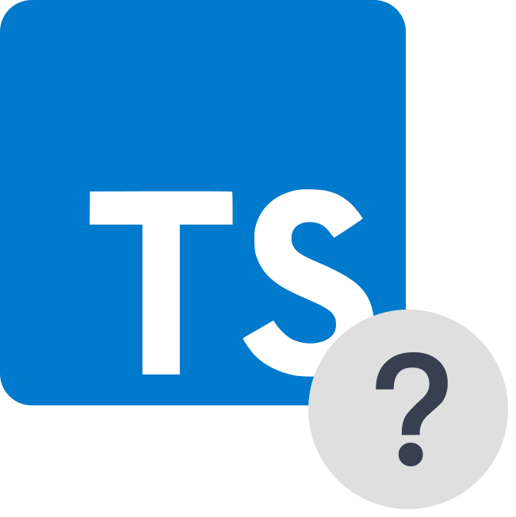

<h1 align="center"></h1>

<h3 align="center">Jak začít s TypeScriptem?</h3>
<h4 align="center">Závěrečná práce z Webových aplikací 2024/2025</h3>

   📕 Naučná webová stránka o jazyce TypeScript
   
   
  
  
  

## 📃 O stránce
**Jak začít s TypeScriptem?** je webová stránka, která je určená jak pro začátečníky v backendu, tak i pro pokročilé, kteří již umí JavaScript

## 🚦 Funkce
*Bude doplňeno*

## 📎 Odkaz na web
https://daneedev.github.io/WBA_Zaverecka/

**Copyright 2025 [@daneedev](https://github.com/daneedev)**